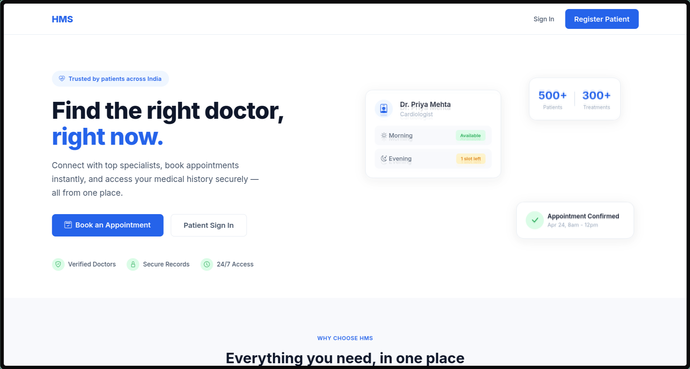
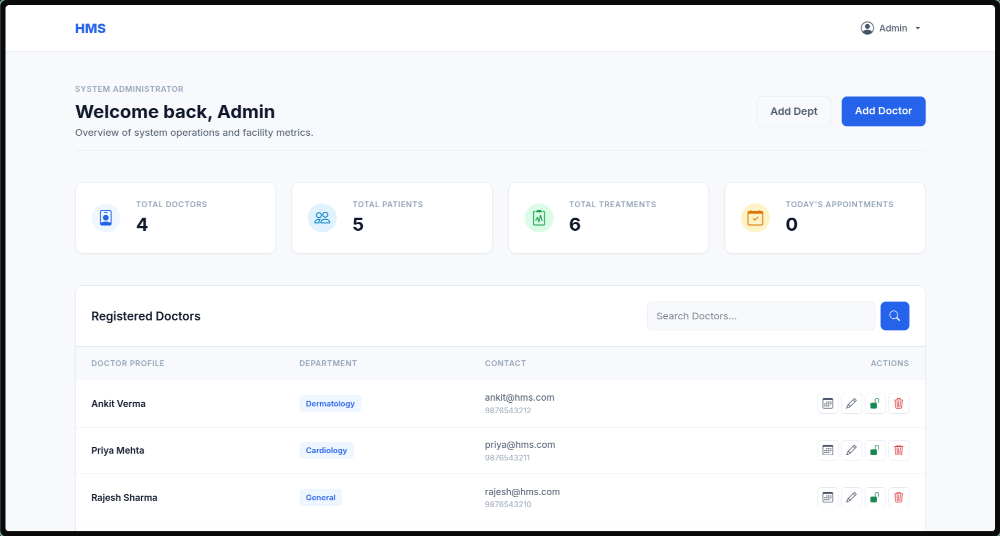
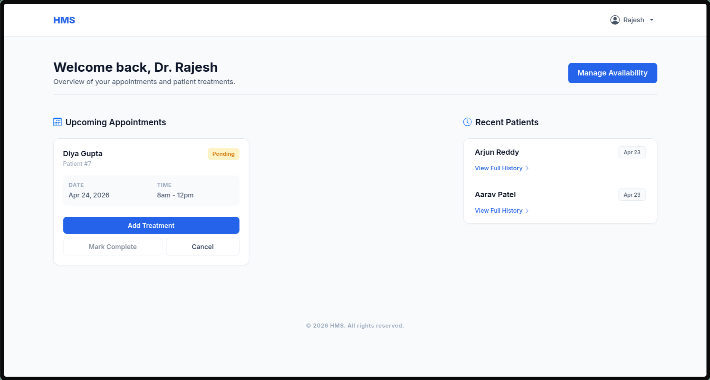
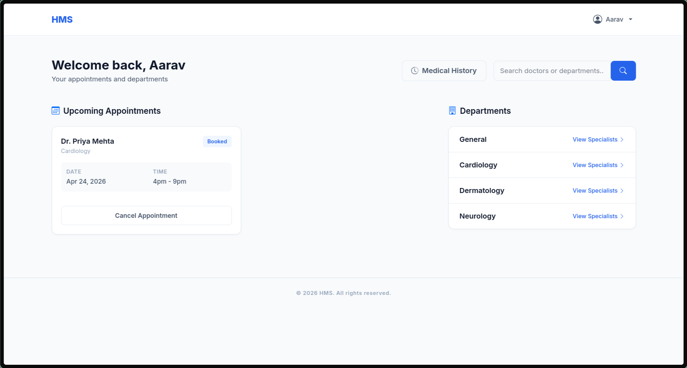
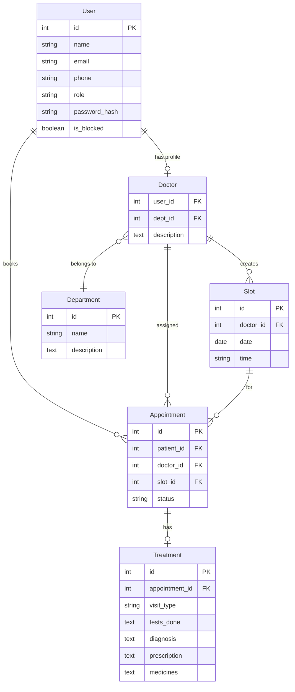

<p align="center">
  <strong style="font-size: 2rem; letter-spacing: -1px;">HMS</strong>
</p>

<h1 align="center">Hospital Management System</h1>

<p align="center">
  A full-stack web application for managing hospital operations — appointments, doctors, patients, and medical records — built with Flask and a modern, clean UI.
</p>

<p align="center">
  
  
  
  
</p>

---

## Preview

<p align="center">
  
</p>

<details>
<summary><strong>View All Dashboards</strong></summary>
<br>

**Admin Dashboard** — Facility metrics, doctor/patient management, appointment logs


<br>

**Doctor Dashboard** — Upcoming appointments, treatment logging, patient history


<br>

**Patient Dashboard** — Appointment booking, department browsing, medical history


</details>

---

## Overview

HMS is a role-based hospital management system designed for three types of users:

| Role | Purpose |
|------|---------|
| **Admin** | Manages the entire facility — onboards doctors, creates departments, monitors metrics, and oversees all appointments |
| **Doctor** | Views assigned patients, manages weekly availability, logs treatments with diagnosis and prescriptions |
| **Patient** | Searches for specialists, books appointments based on real-time slot availability, and reviews medical history |

The system auto-creates an admin account and default departments on first run — no manual database setup required.

---

## Features

### Admin
- Dashboard with live metrics (total doctors, patients, treatments, today's appointments)
- Onboard new doctors with department assignment and credentials
- Create and manage hospital departments
- Block/unblock any user account
- Search doctors and patients with instant filtering
- View all upcoming and past appointments across the facility
- Access any patient's medical history
- Edit doctor profiles and manage their availability

### Doctor
- View upcoming appointments with patient details and time slots
- Add detailed treatment records (diagnosis, tests, prescriptions, medicines)
- Mark appointments as completed after treatment is logged
- Manage weekly availability with a 7-day slot grid (morning/evening shifts)
- View treatment history for previously treated patients

### Patient
- Browse hospital departments and view specialists in each
- Search doctors by name or department
- Check real-time doctor availability for the next 7 days
- Book appointment slots instantly (morning: 8am–12pm, evening: 4pm–9pm)
- Cancel upcoming appointments
- View complete medical history (past treatments, prescriptions, test results)
- Edit personal profile and change password

---

## Tech Stack

| Layer | Technology |
|-------|-----------|
| **Backend** | Python, Flask 3.x |
| **Database** | SQLite with SQLAlchemy ORM |
| **Auth** | Flask-Login with Werkzeug password hashing |
| **Frontend** | Jinja2 templates, Bootstrap 5.3, custom CSS |
| **Icons** | Bootstrap Icons |

---

## Getting Started

### Prerequisites

- Python 3.10 or higher
- pip or [uv](https://docs.astral.sh/uv/) package manager

### Installation

**1. Clone the repository**

```bash
git clone https://github.com/kvm404/hospital-management-system.git
cd hospital-management-system
```

**2. Install dependencies**

```bash
pip install -r requirements.txt
```

**3. Run the application**

```bash
python app.py
```

**4. Open in your browser**

```
http://127.0.0.1:5000
```

> On first run, the app automatically creates the SQLite database, an admin account, and four default departments (General, Cardiology, Dermatology, Neurology).

---

## Default Credentials

| Role | Email | Password |
|------|-------|----------|
| Admin | `admin@hms.com` | `admin123` |

- **Patients** register themselves via the registration page.
- **Doctors** are created by the admin through the dashboard.

---

## Project Structure

```
hospital-management-system/
│
├── app.py                  # Flask app initialization, config, and startup
├── models.py               # SQLAlchemy models (User, Doctor, Department, Slot, Appointment, Treatment)
├── requirements.txt        # Python dependencies
│
├── routes/
│   ├── main.py             # Homepage route
│   ├── auth.py             # Login, register, logout
│   ├── admin.py            # Admin dashboard, doctor/department CRUD, user management
│   ├── doctor.py           # Doctor dashboard, availability, treatments
│   └── patient.py          # Patient dashboard, booking, search, history
│
├── templates/
│   ├── base.html           # Shared layout (navbar, footer, flash messages)
│   ├── index.html          # Public homepage
│   ├── auth/
│   │   ├── login.html
│   │   └── register.html
│   ├── admin/
│   │   ├── admin_dash.html
│   │   ├── add_doctor.html
│   │   ├── edit_doctor.html
│   │   └── add_department.html
│   ├── doctor/
│   │   ├── doctor_dash.html
│   │   ├── update_availability.html
│   │   ├── treatment_form.html
│   │   └── patient_history.html
│   └── patient/
│       ├── patient_dash.html
│       ├── doctor_availability.html
│       ├── doctor_details.html
│       ├── dept_details.html
│       ├── search_results.html
│       ├── edit_profile.html
│       └── history.html
│
├── static/
│   └── style.css           # Custom design system (CSS variables, components, homepage styles)
│
└── screenshots/            # README images
```

---

## Database Schema



---

## License

This project is open source and available under the [MIT License](LICENSE).
